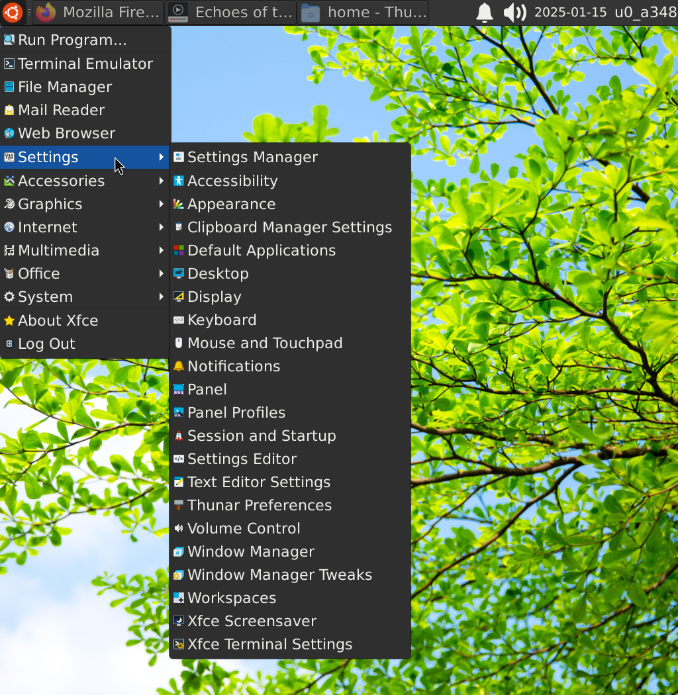

# Installation:

Install latest termux-x11 official:

https://github.com/termux/termux-x11

or install one of the most stable versions and slightly modified for smoother experience from here (for low-end devices only):

[termux-x11](https://github.com/ar37-rs/xfce4-termux/releases/download/Backup/termux-x11-arm64-v8a-debug.zip)

and then
```
cd && pkg install wget openssl which && rm -rf ~/xfce4 && wget https://github.com/ar37-rs/xfce4-termux/raw/refs/heads/main/xfce4 && chmod +x ~/xfce4
```

# Usage from termux terminal:

Install xfce4 dependecies
```
~/xfce4 install
```

Using virglrenderer driver (for such Mali, Adreno many other modern supported GPUs)

[(Read more for virgl additional usage)](https://github.com/ar37-rs/virgl-angle-termux)
```
~/xfce4 driver=virpipe
```

Using llvmpipe driver (software renderer Universal CPUs)
```
~/xfce4 driver=lvp
```

Using llvmpipe driver + zink
```
~/xfce4 driver=lvp-zink
```

Using zink driver (thanks to [alexvorxx](https://github.com/alexvorxx/zink-xlib-termux) for providing zink for xlib termux, working great on GPU Mali-G series as well)
```
~/xfce4 driver=zink
```

Using default driver can be combined with zink, kgsl for Adreno, amd for Xclipse or any supported other gpu drivers (if any)
```
~/xfce4 driver=default
```

and then simply start xfce
```
~/xfce4 s
```

# Additional usage:

Using termux-x11 ```DISPLAY=:1```
```
~/xfce4 display=1
```

Switch back to ```DISPLAY=:0```
```
~/xfce4 display=0
```

Activate termux-x11 ```TERMUX_X11_FORCE_FLIP```

(a workaround for some graphic drivers as mentioned [here](https://github.com/termux/termux-x11/commit/bf70f09f1240fd5491bcbe7a5e7b9bb3d7164c3b))
```
~/xfce4 flip=true
```

Deactivated force flip
```
~/xfce4 flip=false
```

Activate dri3 (needed for some mali panfrost, adreno kgsl, amd, vulkan wrapper and other supported drivers)
```
~/xfce4 dri3=true
```

Deactivated dri3 (default), usually for virgl driver use case if experiencing some issues
```
~/xfce4 dri3=false
```

Using pulseaudio glibc (optional if there's sound problem)
```
~/xfce4 pulse-glibc=true
```

Switch back to pulseaudio bionic (default)
```
~/xfce4 pulse-glibc=false
```

Enable sdcard storage
```
~/xfce4 sdcard=true
```
and then test cd to sdcard ```cd /sdcard```

Quite or terminate all xfce4 and 3d party process
```
~/xfce4 q
```

# Note:
* If there's problem when installing, make sure the latest correct termux app version is installed [from here](https://github.com/termux/termux-app/releases)

* Tested using termux app v0.119.0-beta.1

# Additional troubleshoot
* Fix virgl-angle vulkan support for some devices

   [such encountered on this issue](https://github.com/ar37-rs/virgl-angle-termux/issues/1)
   ```
   pkg remove *icd-swrast && pkg install vulkan-loader-generic wget openssl && cd && rm -rf ~/mesa-vulkan-icd-wrapper_25.0.0-1_aarch64.deb && wget https://github.com/ar37-rs/virgl-angle-termux/releases/download/latest/mesa-vulkan-icd-wrapper_25.0.0-1_aarch64.deb && dpkg -i ~/mesa-vulkan-icd-wrapper_25.0.0-1_aarch64.deb
   ```
   
* Fix for android 12+ devices with [Process completed (signal 9) - ...] issue using adb:
   ```
   adb shell "settings put global settings_enable_monitor_phantom_procs false"
   ```
   and set max_phantom_processes as well
   ```
   adb shell "/system/bin/device_config set_sync_disabled_for_tests persistent"
   adb shell "/system/bin/device_config put activity_manager max_phantom_processes 2147483647"
   ```
   and then restart/reboot device.
   [read more for more info from here](https://ivonblog.com/en-us/posts/fix-termux-signal9-error/) or [here](https://github.com/termux/termux-app/issues/2366)
